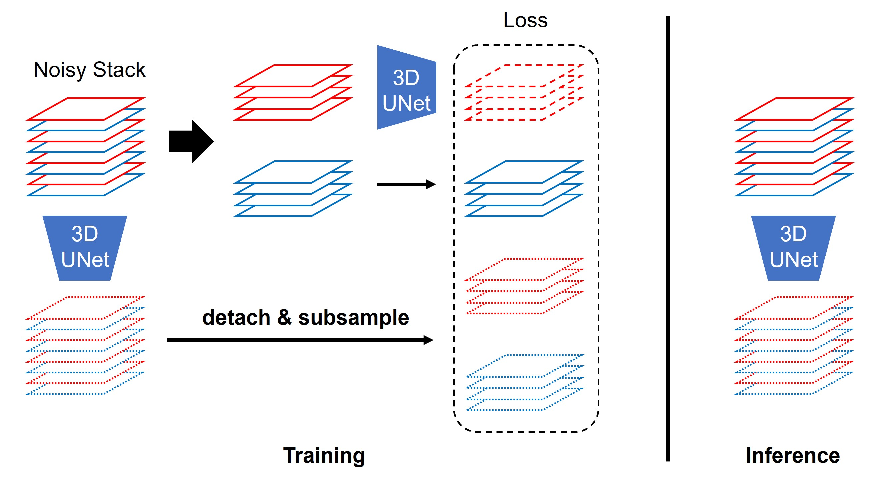
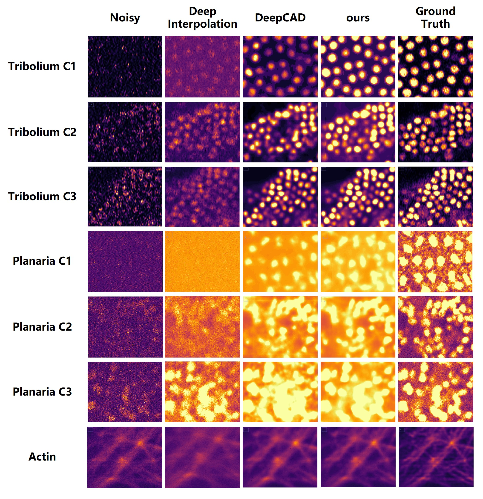

# Self-supervised Denoising under Variations between Adjacent Slices for Fluorescence Microscopy Image Stacks

Implementation for the paper 《Self-supervised Denoising under Variations between Adjacent Slices for Fluorescence Microscopy Image Stacks》. Our code is modified based on the open-source code of [DeepCAD](https://github.com/cabooster/DeepCAD).





## Environment

* python >= 3.6
* pytorch >= 1.3.1

## Data Preparation

Using the datasets *Planaria* and *Tribolium* provided by [CARE](https://github.com/CSBDeep/CSBDeep) as examples:

1. Download the datasets from the [link](https://publications.mpi-cbg.de/publications-sites/7207/%E2%80%B8).
2. Place noisy stacks into a custom folder.

If you are using your own datasets, it is important to pay attention to the file format. Currently, the codel has been primarily validated on 16-bit `.tif` stack files. If necessary, adjustments can be made to the `dataset.py` file to accommodate specific requirements.

## Train and Test

* **Train**

```bash
python train.py -n <dataset_name> -d <dataset_path> ...

# example:
python train.py -n Tribolium_C1 -d './data/Tribolium_C1/stacks' --validation
```

* **Test**

```bash
python test.py -n <dataset_name> -d <dataset_dir> -m <model_dir> -s <model_number>

# example
python test.py -n Tribolium_C1 -d './data/Tribolium_C1/stacks' -m Tribolium_C1_202403141108 -s '10,20,30'
```

For details on parameter configurations and their meanings, you can refer to the documentation or use the following command for inquiry:

```bash
python train.py --help

python test.py --help
```
